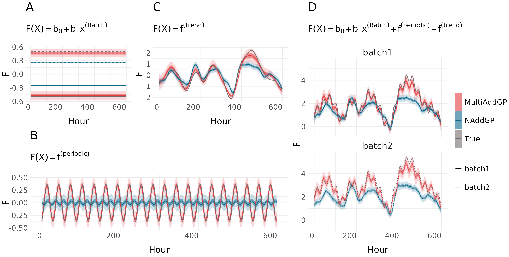

## MultiAddGPs (Multinomial Logistic Normal Additive Gaussian Process Model)
This repository contains code accompanying XXX


## Brief Overview
**MultiAddGPs** is a powerful statistical model designed to analyze additive linear and nonlinear effects on compositional count data, particularly suited for relative abundance analysis in microbiome studies or similar high-dimensional compositional datasets. The model leverages the Multinomial Logistic-Normal distribution, combined with Additive Gaussian Processes, to capture complex mixed linear and non-linear dynamics.




## Reproducibility
To reproduce the figures presented in the main text, follow the instructions below:

1. Clone the repository to your local machine:
```sh
git clone https://github.com/tinghua-chen/MultiAddGPs.git
```
2. Install the necessary R packages:
```r
packages <- c("fido","dplyr","LaplaceDemon","mvtnorm","MASS","ggplot2","rBayesianOptimization","lubridate","gridExtra")
install.packages(packages)
```
3. Run `00_package_loading.R` to loading all necessary dataset


### Reproducing Figure 1:
To generate Figure 1, simply run the `figure1.R` script. This will reproduce the figure based on the default dataset and model configuration.

### Reproducing Figures 3 & 4:
To reproduce Figures 3 and 4, follow these steps:

1. Run `01_data_preprocessing.R` to load and preprocess the artificial gut dataset
3. Run `02_analysis.R` to perform the required analysis on the dataset
4. Run `figure3&4.R` to generate Figures 3 and 4.


## Example

I have created a vignette demonstrating how to apply MultiAddGPs in practice using artificial gut data. You can view it [here](https://tinghua-chen.github.io/blog/MultiAddGPs/).

Note: MultiAddGPs extends the functionality of our previous [fido](https://jsilve24.github.io/fido/articles/non-linear-models.html) package to accommodate both linear and nonlinear modeling in count data. If you haven't done so yet, I highly recommend reviewing the *basset* vignette in the *fido* package before working through the above example.
## Contact
If you have any questions, don't hesitate to create an issue or reach out to tuc579@psu.edu