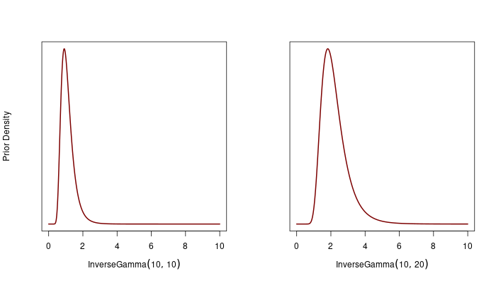
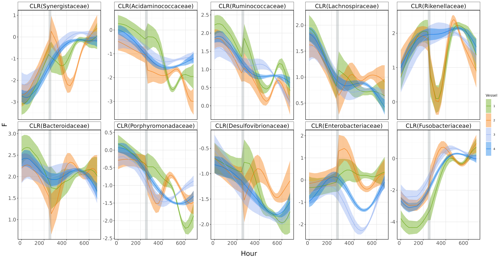
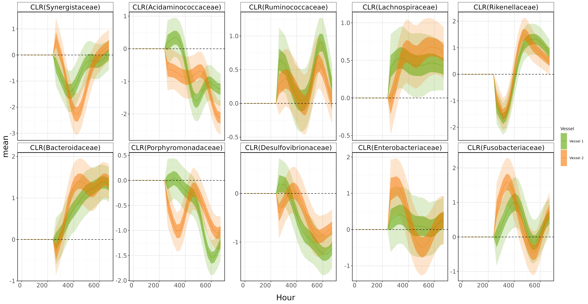

 ## Reanalyzing the Mallard Dataset from Silverman et al. (2018)

MultiAddGPs are designed for modeling a mix of linear and non-linear factors in compositional count data. In this post, I'll walk you through a reanalysis of the mallard dataset from Silverman et al. (2018) to show how you can apply MultiAddGP modeling in a real-world microbiome study.

The dataset contains over 500 samples collected from 4 idependent artificial gut vessels, taken at irregular time intervals. What makes this dataset interesting is that Vessels 1 and 2 experienced starvation around days 11 and 13, while Vessels 3 and 4 were left untouched as controls. Here's a visual to give you a sense of what the data looks like:
    

### What We’ll Cover
In this post, I’ll walk you through three key aspects of the analysis:

+ How to use MultiAddGPs (via the *basset* tool in the fido package) to model additive Gaussian Processes and how to isolate the effects of food disruption.
+ How to model four independent vessels or how to model four concurrent time sereis simultaneously using block identity matrices.
+ How to select the model’s hyperparameters using Penalized Maximum Marginal Likelihood (MML).

### Before You Begin: Recommended Reading
If you’re new to MultiAddGPs or *basset*, I recommend first going through the *basset* vignette, which introduces the basic concepts. It’s a great starting point for understanding how MultiAddGPs work, and you can check it out [here](https://jsilve24.github.io/fido/articles/non-linear-models.html).

OK, Let's get started!

### Data preprocessing
To start, the data preprocessing steps mostly follow the analysis by Silverman et al. (2018). Below is the code I used to prepare the data and set up the design matrix for the model:
```r   
library(fido)
library(dplyr)
library(LaplacesDemon)
library(mvtnorm)
library(MASS) # for mvrnorm
library(ggplot2)
library(rBayesianOptimization)
library(lubridate)
library(gridExtra)

mallard_family$sample_data <- mallard_family$sample_data %>% 
    select(X.SampleID,time,Vessel,SampleType,batch)%>%
    group_by(Vessel)%>%
    arrange(time)%>%
    filter(!duplicated(time))%>%
    mutate(time_num = as.numeric(time),
        Hour = (time_num - min(time_num))/3600,
        SampleType = ifelse(time_num == "1448031600","Hourly",SampleType),
        SampleType = ifelse(time_num %in% c("1448550000","1448636400","1448722800","1448809200"),"Daily",SampleType),
        Hour_diff = (Hour-mean(Hour))/sd(Hour), 
        Hour_sample = ifelse(SampleType == "Hourly",1,0),
        Daily_sample = ifelse(SampleType == "Daily",1,0),
        burnout  = ifelse(time < "2015-11-11 15:00:00",1,0),
        Vessel1 = ifelse(Vessel == 1,1,0),
        Vessel2 = ifelse(Vessel == 2,1,0),
        Vessel3 = ifelse(Vessel == 3,1,0),
        Vessel4 = ifelse(Vessel == 4,1,0),
        Vessel1Burn = ifelse(Vessel == 1 & burnout != 1,1,0),
        Vessel2Burn = ifelse(Vessel == 2 & burnout != 1,1,0)
        )%>%
    arrange(Vessel)


#match sample_data to the otu_table
mallard_family$otu_table <- mallard_family$otu_table[mallard_family$sample_data$X.SampleID,] 


# Onehot encoding for the Batch and select X
X1 <- mallard_family$sample_data %>%
            dplyr::select(X.SampleID,Vessel,Vessel1,Vessel2,Vessel3,Vessel4,Vessel1Burn,Vessel2Burn,Hour_diff,Hour)

Hour <- X1$Hour
Hour_diff <- X1$Hour_diff
Vessel <- paste0("Vessel ",X1$Vessel)
Vessel1 <- X1$Vessel1
Vessel2 <- X1$Vessel2
Vessel3 <- X1$Vessel3
Vessel4 <- X1$Vessel4
Vessel1Spike <- X1$Vessel1Spike
Vessel2Spike <- X1$Vessel2Spike
Veseel1Burn <- X1$Vessel1Burn
Vessel2Burn <- X1$Vessel2Burn
    
# Transpose to get the right dimensions 
X<- t(model.matrix(~ Vessel1+Vessel2+Vessel3+Vessel4+Veseel1Burn+Vessel2Burn+Hour_diff,data = X1)) 

#  Extract Data / dimensions from Phyloseq object
Y <- t(as(mallard_family$otu_table, "matrix"))
rownames(Y) <- mallard_family$tax_table$Family

if (identical(colnames(Y), X1$X.SampleID)) {
    colnames(Y) <- colnames(X)
} else {
    warning("The order of the samples in the otu_table and sample_data are not the same")
}

D <- nrow(Y)
N <- nrow(mallard_family$sample_data)
C <- nrow(X)
```


### The Modeling Process

Since our goal here is to isolate the impact of feed disruption, we approached the problem by breaking it down into two overlapping processes: 
- A long-term trend specific to each vessel ($f^{(\text{base}, v)}$) 
- A disruption effect due to starvation ($f^{(\text{disrupt}, v)}$) for Vessels 1 and 2. 


Here's a glimpse of the math behind it:

$$
\mathbf{Y}_{\cdot n} \sim \text{Multinomial}(\mathbf{\Pi}_{\cdot n})
$$

$$
\mathbf{\Pi}_{\cdot n} = \text{ALR}_{D}^{-1}(\mathbf{H}_{\cdot n})
$$

$$
\mathbf{H}_{\cdot n} \sim N(\mathbf{F}_{\cdot n}, \mathbf{\Sigma})
$$

$$
\mathbf{F} = \sum_{v=1}^4\mathbf{f}^{(\text{base},v)}(t_{n}) + I[v \in \{1,2\}]\mathbf{f}^{(\text{disrupt}, v)}(t)
$$


$$
\mathbf{\Sigma} \sim \text{InvWishart}(\mathbf{\Xi}, \zeta)
$$

Basically, we’ve got a vessel-specific long-term trend plus the starvation impact for Vessels 1 and 2. For Vessels 3 and 4, we only model the long-term trend since they weren’t disrupted. We then applied Gaussian Processes (GPs) to each of these trends, where:

$$
\mathbf{f}^{(\text{base}, v)} \sim \text{GP}(\mathbf{\Theta}^{(\text{base}, v)}, \mathbf{\Sigma}, \mathbf{\Gamma}^{(v)} \odot \mathbf{\Gamma}^{(\text{base})}), \quad v \in \{1,2,3,4\}
$$

$$
\mathbf{f}^{(\text{disrupt}, v)} \sim \text{GP}(\mathbf{\Theta}^{(\text{disrupt}, v)}, \mathbf{\Sigma}, \mathbf{\Gamma}^{(v)} \odot \mathbf{\Gamma}^{(\text{disrupt})}), \quad v \in \{1,2\}
$$

and $\odot$ represent the Kronecker product. 


```r
upsilon <- D+5
Model <- function(
    Y,X,upsilon,
    sigma1,l1, 
    sigma2,l2,a2,noise
) {
    set.seed(893)
    Xi <- matrix(0.4,D-1,D-1)
    diag(Xi) <- noise 

    # stationary kernel implementation
    Gamma_vessel1 <-function(X) {SE(X,sigma = sigma1, rho = l1,Identity_row = 1,X_row = C)}
    Gamma_vessel2 <-function(X) {SE(X,sigma = sigma1, rho = l1,Identity_row = 2,X_row = C)}
    Gamma_vessel3 <-function(X) {SE(X,sigma = sigma1, rho = l1,Identity_row = 3,X_row = C)}
    Gamma_vessel4 <-function(X) {SE(X,sigma = sigma1, rho = l1,Identity_row = 4,X_row = C)}
    Gamma_vessel1Spike <-function(X) {RQ(X,sigma = sigma2, rho = l2,a=a2,Identity_row = 5,X_row = C)}
    Gamma_vessel2Spike <-function(X) {RQ(X,sigma = sigma2, rho = l2,a=a2,Identity_row = 6,X_row = C)}

    Theta_kernel <- function(X) matrix(0, D-1, ncol(X))

    Theta <- list(Theta_kernel,Theta_kernel,Theta_kernel,Theta_kernel,Theta_kernel,Theta_kernel)
    Gamma <- list(Gamma_vessel1, Gamma_vessel2,Gamma_vessel3,Gamma_vessel4,Gamma_vessel1Spike,Gamma_vessel2Spike)

    mod <- fido::basset(Y, X, upsilon, Theta, Gamma, Xi, verbose = TRUE, seed = 893)
}
```

Note that, the input of `Theta` is a list. The element of the list can either be functions over the correct dimensions (for modeling non-linear factor) or an matrix of correct size (for modeling linear factor). 

If you wish to add a linear factor, for example adding a intercept term, you will need to add 

```diff
Model <- function(
    Y,X,upsilon,
    sigma1,l1, 
    sigma2,l2,a2,noise
) {
    ...

+   linear_component_theta <- matrix(0,D-1 ,1)
+   linear_component_gamma <- diag(1)

    # stationary kernel implementation
    ...
}
```
to the `Model` function,  and your `basset` argument will need to be adjusted as following:

```diff
Model <- function(
    Y,X,upsilon,
    sigma1,l1, 
    sigma2,l2,a2,noise
) {
    ...
-   Theta <- list(Theta_kernel,Theta_kernel,Theta_kernel,Theta_kernel,Theta_kernel,Theta_kernel)
-   Gamma <- list(Gamma_vessel1, Gamma_vessel2,Gamma_vessel3,Gamma_vessel4,Gamma_vessel1Spike,Gamma_vessel2Spike)

-   mod <- fido::basset(Y, X, upsilon, Theta, Gamma, Xi, verbose = TRUE, seed = 893)
+   Theta <- list(linear_component_theta,Theta_kernel,Theta_kernel,Theta_kernel,Theta_kernel,Theta_kernel,Theta_kernel)
+   Gamma <- list(linear_component_gamma,Gamma_vessel1, Gamma_vessel2,Gamma_vessel3,Gamma_vessel4,Gamma_vessel1Spike,Gamma_vessel2Spike)

+   mod <- fido::basset(Y, X, upsilon, linear= c(1), Theta, Gamma, Xi, verbose = TRUE, seed = 893)

}
```

### Modeling Concurrent Time Series Jointly

To jointly model the four concurrent time series (4 vessels), we use block identity matrices $ \mathbf{\Gamma}^{v}$, structured as follows:

$$
\bm{\Gamma}^{(v)} \odot \bm{\Gamma}^{(\text{base})} =  
\begin{bmatrix}
    \bm{\Gamma}^{(v=1,\text{base})} & 0 & 0 & 0 \\
    0  & \bm{\Gamma}^{(v=2,\text{base})} & 0 & 0 \\
    0 & 0 & \bm{\Gamma}^{(v=3,\text{base})} & 0 \\
    0 & 0 & 0 & \bm{\Gamma}^{(v=4,\text{base})}
\end{bmatrix}
$$

Each of $\bm{\Gamma}^{(v=i,\text{base})}$ is a $V_i$ dimension of covariance matrix ($V_i$ is the dimension of $i$ vessel). That means, the dimension of $\bm{\Gamma}^{(v)} \odot \bm{\Gamma}^{(\text{base})}$ must be a $N \times N$ matrix, where $N = V_1+V_2+V_3+V_4$. 


For vessels experiencing disruption, we apply a similar approach, but limit it to Vessels 1 and 2:

$$
\begin{align*}
    \bm{\Gamma}^{(v)} \odot \bm{\Gamma}^{(\text{disrupt})} =  
    \begin{bmatrix}
        \bm{\Gamma}^{(v=1,\text{disrupt})} & 0 \\
        0  & \bm{\Gamma}^{(v=2,\text{disrupt})}\\
    \end{bmatrix}
\end{align*}
$$

These matrices serve as the covariance structures for the vessel-specific long-term trends $ \mathbf{f}^{(\text{base}, v)} $ and disruption effects $ \mathbf{f}^{(\text{disrupt}, v)} $. Since the vessels are physically isolated from each other, covariances between different vessels are set to zero (e.g., $ \text{cov}(\bm{\Gamma}^{(v=1,\text{base})}, \bm{\Gamma}^{(v=2,\text{base})}) = 0 $).

All mean functions are set to zero, such that $ \mathbf{\Theta}^{(\text{base},v)} = 0 $. We use a squared exponential kernel to model the long-term nonlinear trends in $ \mathbf{\Gamma}^{(\text{base})} $:

$$
\bm{\Gamma}^{(\text{base})} = \sigma_{\text{base}}^2 \exp\left(- \frac{(t - t')^2}{2 \rho_{\text{base}}^2} \right)
$$

For the disruption effects, we use a rational quadratic kernel, set to zero before day 10. This reflects the assumption that the target variable may exhibit smoothness or irregularities starting from the starvation period:

$$
\bm{\Gamma}^{(\text{disrupt})} = \sigma_{\text{disrupt}}^2 \left( 1 + \frac{(t - t')^2}{2a \rho_{\text{disrupt}}^2} \right)^{-a} \mathbf{I}(t \geq 11 \, \& \, t' \geq 11)
$$

Here, $ \mathbf{I}(t \geq 11 \, \& \, t' \geq 11) $ is also a block identity matrix but reflects the fact that disruption occurs only after day 11, and its effects persist through the rest of the study.

To implement this in R, you need to create dummy variables in your design matrix corresponding to the specific vessels (e.g., where 1 represents the vessel in question and 0 represents all others). You can then build block matrix kernels for each vessel. Here's an example of how to create such a function for the kernel:


```r
## Squared Exponential Kernel
SE <- function(X, sigma = 1, rho = median(as.matrix(dist(t(X)))), 
            Identity_row = NULL,X_row,jitter = 1e-10){

    if (is.null(Identity_row)){
        dist <- as.matrix(dist(t(X[X_row,,drop=FALSE])))
        G <- sigma^2 * exp(-dist^2/(2 * rho^2)) + jitter * diag(ncol(dist))
    }
    else {
        block <- t(t(X[Identity_row,]))%*%t(X[Identity_row,]) # block matrix
        dist <- as.matrix(dist(t(X[X_row,,drop=FALSE])))
        G <- sigma^2 * exp(-dist^2/(2 * rho^2)) 

        if (all(dim(block) != dim(G))){
            stop("The dimension of block matrix and G should be the same")
        }
        G <- block*G + jitter * diag(ncol(dist))
    }
    return(G)
}

```
    

### Hyperparameter Tuning in Our Model: Finding the Sweet Spot

Hyperparameter selection is always a critical part of modeling, whether you're dealing with linear or non-linear functions (like choosing the right kernel parameters). But with our model, we can push the flexibility even further. Hyperparameter optimization isn’t limited to just the kernel function—it can also extend to the mean function or even log-ratio transformations, like  $f(\Eta; \Omega)$. 

In our case, we’re optimizing four hyperparameters ($\sigma_{\text{base}}, \sigma_{\text{disrupt}}, \rho_{\text{base}}, \rho_{\text{disrupt}}$), and we’re doing this using Penalized Maximum Marginal Likelihood (MML). I would prefer using Penalized MML when it's difficult to identify a clear range for the hyperparameters. The choice of penalization is up for the user.

Here’s how we set it up:

$$
\begin{align*} 
\rho_{\text{base}}, \rho_{\text{disrupt}} &\sim \text{InverseGamma}(\alpha_1, \beta_1) \\
\sigma_{\text{base}}, \sigma_{\text{disrupt}} &\sim \text{InverseGamma}(\alpha_2, \beta_2)
\end{align*}
$$

We chose $\alpha_1 = 10$, $\beta_1 = 20$, and $\alpha_2 = 10$, $\beta_2 = 10$ for $\bm{\Gamma}^{(\text{base})}$. For $\bm{\Gamma}^{(\text{disrupt})}$, we used $\alpha_1 = 10$, $\beta_1 = 10$, and $\alpha_2 = 10$, $\beta_2 = 20$. 




Note we fixed the $a$ parameter in the rational quadratic kernel at 2. This parameter controls how much weight is given to large-scale vs. small-scale variations. By doing these specification, we’re essentially saying we don't expect the model to learn extreme length scales—whether very small or very large—since these wouldn’t make sense given the time intervals in the data. So, the prior helps to keep the model in check, preventing it from overfitting to unusual patterns.

To further refine the model, we also added a constraint: $\sigma_{\text{base}} < \sigma_{\text{disrupt}}$. This reflects our assumption that more variation comes from the starvation effects, based on previous study Silverman et al. (2018). Similarly, we set $\rho_{\text{base}} > \rho_{\text{disrupt}}$ to account for smoother trends in the base kernel, since starvation should lead to more abrupt changes. Note that we did not center the posterior samples at a mean of 0, as no intercept was included in the model.


```r
MLL <- function(Y,X,upsilon,
            sigma1,l1,
            sigma2,l2,a2,
            noise
            ){

    set.seed(893)
    sigma <- c(sigma1, sigma2)
    sigma <- sigma[order(sigma)]

    rho <- c(l1, l2)
    rho <- rho[order(rho)]

    # prior for length/sigma ~ InverseGamma(alpha,beta) 
    alpha1 <- 10
    beta1  <- 20 

    alpha2 <- 10
    beta2 <- 10 

    log_prior_l1 <- (alpha1 * log(beta1) - lgamma(alpha1) - (alpha1 + 1) * log(l1) - beta1/ l1)
    log_prior_l2 <- (alpha2 * log(beta2) - lgamma(alpha2) - (alpha2 + 1) * log(l2) - beta2/ l2)

    log_prior_s1 <- (alpha2 * log(beta2) - lgamma(alpha2) - (alpha2 + 1) * log(sigma1) - beta2/ sigma1)
    log_prior_s2 <- (alpha1 * log(beta1) - lgamma(alpha1) - (alpha1 + 1) * log(sigma2) - beta1/ sigma2)

    prior <- log_prior_l1 + log_prior_l2 + log_prior_s1 + log_prior_s2
    prior_lambda <- 120

    mod <- Model(Y,X,upsilon,
                sigma1= sigma[1],l1 = rho[2],
                sigma2 = sigma[2],l2 = rho[1],a2,
                noise
                )

    list(Score = mod$logMarginalLikelihood + prior*prior_lambda)
}

```
Due to the often non-convex nature of the MML landscape, especially when estimating bandwidth parameters in kernel functions, we employ **Bayesian optimization** techniques. Bayesian optimization is well-suited for optimizing non-convex functions while significantly reducing the number of function evaluations compared to traditional optimizers like L-BFGS. 

```r
set.seed(893)
optObj <- bayesOpt(
FUN = function(sigma1,l1, sigma2,l2)
    MLL(Y,X,upsilon,
        sigma1,l1,
        sigma2,l2,a2 =2,
        noise = 1
    ),
    bounds = list(
        sigma1 = c(0.1,2),
        l1 = c(1,3),
        sigma2 = c(1,4),
        l2 = c(0.1,2)
    ),
    initPoints = 10,
    iters.n = 20,
    verbose = 1
)

optObj$scoreSummary
getBestPars(optObj)

```


Now we can fit back the optimized hyperparameter to the model and look at the result:


```r
hyper <- c(getBestPars(optObj)$sigma1,getBestPars(optObj)$l1,
           getBestPars(optObj)$sigma2,getBestPars(optObj)$l2,
           2,1)
           
mod <- Model(Y,X,upsilon,sigma1=hyper[1],l1=hyper[2],
                         sigma2=hyper[3],l2=hyper[4], 
                         a2=hyper[5],noise=hyper[6])
```
Here, I’m going to visualize the smooth patterns captured by the MultiAddGPs model, projected onto CLR (Centered Log-Ratio) coordinates. 


```r
## Prediction: plot in CLR space  ##########
mod_clr <- to_clr(mod)
predicted <- predict(mod_clr,response = "Lambda")
rownames(predicted) <- rownames(Y)
taxa_names <- as(mallard_family$tax_table$Family,"vector")


# summarize prediction in clr space 
predicted_clr_tidy <- gather_array(predicted,val,coord,sample,iter)%>%
    arrange(coord,iter)%>%
    mutate(coord = paste0("CLR(",taxa_names[coord], ")"))%>%
    mutate(coord = factor(coord,levels = unique(coord)))%>%
    mutate(Hour = rep(Hour,max(iter)*D))%>%
    mutate(Vessel = as.factor(rep(Vessel,max(iter)*D)))%>%
    filter(!is.na(val))%>%
    group_by(Vessel,coord,Hour)%>%
    summarise_posterior(val,na.rm = TRUE)%>%
    ungroup()


custom_colors <- c('#5ba300','#f57600','#8babf1','#0073e6')
custom_colors_v12 <- c('#5ba300','#f57600')


# Merge the calculated limits back to the original data
predicted_clr_tidy <- predicted_clr_tidy %>%
  left_join(facet_lims, by = "coord")

p <- ggplot(predicted_clr_tidy,aes(x=Hour,y=mean))+
      facet_wrap(~coord, scales="free_y", ncol=5) +
      geom_ribbon(aes(ymin = p2.5, ymax = p97.5,fill= Vessel), alpha = 0.4) +
      # geom_ribbon(aes(ymin = p25,  ymax = p75,  fill= Vessel), alpha = 0.4) +
      geom_line(aes(color=Vessel),alpha = 0.7,size = 0.7) +
      scale_fill_manual(values = custom_colors) +        
      scale_color_manual(values = custom_colors) +
      # Additional customizations
      theme(
        panel.background = element_rect(fill = "white", color = NA),
        plot.background = element_rect(fill = "white", color = NA),
        panel.grid.major = element_line(color = "gray90"),
        panel.grid.minor = element_line(color = "gray95"),
        strip.background = element_rect(fill = "white", color = "black"),
        strip.text = element_text(color = "black",size = 10),
        panel.border = element_rect(color = "black", fill = NA, size = 1),
        axis.title.y = element_text(size = 8), 
        axis.title.x = element_text(size = 8), 
        axis.text.x = element_text(angle = 0, hjust = 1),
        plot.title = element_text(size = 10),
        legend.title = element_blank()) +   
      labs(y = expression(Lambda), x= "Hour")+
      annotate("rect", xmin = 240, xmax = 264, ymin = -Inf, ymax = Inf, fill = "#717D7E", alpha = 0.15) 
```



As you can see, the plot describe clear disruption effect around Day 11-13 (gray area). Yah!

**BUT REMEMBER!** Our goal is to isolate the food disruption effect in the vessels 1 and 2. To do that, we just need to pull `Lambda` from `mod_clr`. 
```r
# Lambda Decomposition
combine_vessel_summaries <- function(mod_clr, lambda_component,filter_lambda_vessel1, filter_lambda_vessel2, time_column, coords, CLR = TRUE) {
  combined_summary <- data.frame()  # Initialize an empty dataframe to store combined summaries
  
  component1<-lambda_component[1]
  component2<-lambda_component[2]

  for (coord in coords) {
    vessel1_summary <- Summary_function(
      mod_clr$Lambda[[component1]],
      iteration = TRUE,
      filter_lambda = filter_lambda_vessel1,
      time_column = time_column,
      filter_coord = coord,
      CLR = CLR
    )
    
    vessel2_summary <- Summary_function(
      mod_clr$Lambda[[component2]],
      iteration = TRUE,
      filter_lambda = filter_lambda_vessel2,
      time_column = time_column,
      filter_coord = coord,
      CLR = CLR
    )
    
    # Add the Vessel and Coord identifiers
    vessel1_summary$Vessel <- "Vessel 1"
    vessel2_summary$Vessel <- "Vessel 2"
    vessel1_summary$Coord <- coord
    vessel2_summary$Coord <- coord
    
    # Combine the summaries
    combined_summary <- rbind(vessel1_summary, vessel2_summary)
  }
  
  return(combined_summary)
}


dis_allcoord <- combine_vessel_summaries(mod_clr,lambda_component = c(5,6), Vessel1, Vessel2, Hour, c(1:10))%>%
                arrange(Coord)%>%
                mutate(Coord = paste0("CLR(",taxa_names[Coord], ")"))%>%
                mutate(Coord = factor(Coord,levels = unique(Coord)))


disruption_plot <- ggplot(data = dis_allcoord, aes(x = time, y = mean)) +
                      facet_wrap(~Coord, scales="free_y", ncol=5) +
                      geom_ribbon(aes(ymin = p2.5, ymax = p97.5,fill = Vessel), alpha = 0.2) +
                      geom_ribbon(aes(ymin = p25, ymax = p75,   fill = Vessel), alpha = 0.5) +
                      geom_line(aes(color=Vessel),alpha = 0.4, size = 0.7) +
                      geom_hline(yintercept = 0, color = "black", linetype = "dashed") +  
                      scale_fill_manual(values = custom_colors_v12) +          
                      scale_color_manual(values = custom_colors_v12) +  
                      # Additional customizations
                      theme(
                              legend.position = "none",
                              panel.background = element_rect(fill = "white", color = NA),
                              plot.background = element_rect(fill = "white", color = NA),
                              panel.grid.major = element_line(color = "gray90"),
                              panel.grid.minor = element_line(color = "gray95"),
                              axis.title.y = element_text(size = 8),  
                              axis.title.x = element_text(size = 8), 
                              axis.text.x = element_text(angle = 0, hjust = 1),
                              plot.title = element_text(size = 16),
                              panel.border = element_rect(color = "black", fill = NA, size = 1) 
                          )+
                      labs(x= "Hour")

```


Boom!💥💥💥